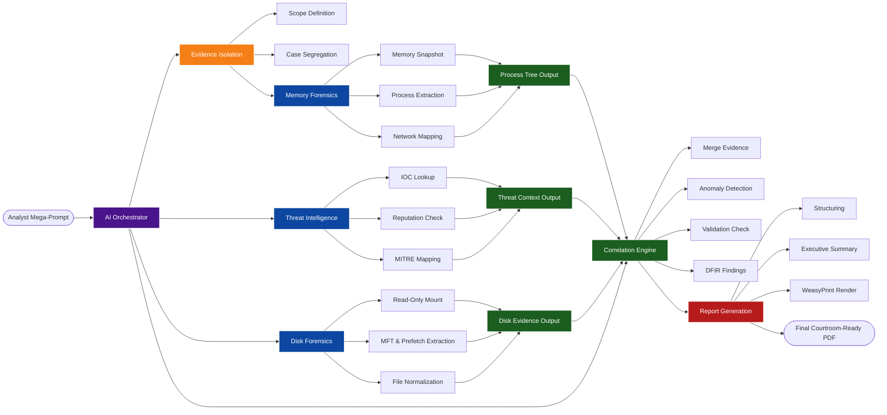

# Extensible DFIR MCP Platform (Protocol SIFT)

> **SANS Hackathon Submission**
> 
> *An autonomous, zero-spoliation digital forensics platform. Wrap SIFT's tools into a type-safe MCP server, execute multi-source correlation, dynamically load zero-code YAML extensions, and output courtroom-ready PDF reports.*

---

## 🏆 Hackathon Ideas Implemented
This architecture natively solves several of the hardest problems in AI-assisted DFIR:

1. **The Purpose-Built MCP Server (Zero Spoliation):** LLMs do not get raw bash access. They must route through our FastMCP server. Disk evidence is safely exposed via `mount_e01_image` which enforces OS-level `ntfs-3g ro,loop` read-only mounts. Evidence cannot be modified.
2. **The Self-Correcting Triage Agent (Anti-Hallucination):** The Detection Engine heuristics strictly enforce the DFIR standard of *Observed Fact → Evidence → Inference → Conclusion*. Findings natively return `requires_validation=True` and `alternative_explanations` to prevent the AI from jumping to speculative conclusions.
3. **Multi-Source Correlation Engine:** Seamlessly merges memory extraction (Volatility 3) and disk artifacts ($MFT, Prefetch, Evtx) into unified timelines.
4. **Zero-Code Extensibility:** The Dynamic Plugin Loader instantly compiles any `.yaml` or `.py` files dropped into the `plugins/` directory into type-safe AI tools without requiring server restarts.

## 🏗 Architecture

The platform acts as an unbreachable wall between the AI and the raw evidence, guaranteeing chain-of-custody integrity while granting the LLM massive analytical power.



## 🚀 Setup & Execution

### 1. Requirements
* Python 3.14+
* `ewf-tools` and `ntfs-3g` (for `.e01` disk mounting)
* `weasyprint` (for PDF generation)

### 2. Run the Server
The environment is pre-configured. Start the FastMCP server:
```bash
source venv/bin/activate
python server.py
```

### 3. Claude Desktop Configuration
Add the server to your `claude_desktop_config.json`:
```json
{
  "mcpServers": {
    "sift-dfir-mcp": {
      "command": "/home/sansforensics/Desktop/sift-mcp/venv/bin/python",
      "args": [
        "/home/sansforensics/Desktop/sift-mcp/server.py"
      ]
    }
  }
}
```

## 🧩 Adding New Tools (Zero-Code YAML)
You do not need to know Python to extend this platform. Simply drop a `.yaml` file into the `plugins/` directory.

Example `plugins/network/check_ip.yaml`:
```yaml
name: check_ip_reputation
description: "Checks the reputation of an IP address using curl."
arguments:
  ip_address:
    type: str
command: "curl -s 'https://api.threatintel.com/ip/{ip_address}'"
```
The server will dynamically generate a Python tool, inject the arguments safely, and register it with the AI automatically.

## 📄 Executive PDF Reporting
To prevent massive walls of unreadable text in the chat interface, the platform includes a WeasyPrint renderer (`plugins/analysis/custom_report.py`). The LLM will automatically generate elegant, styled HTML and compile it into a confidential PDF document saved directly to your workspace.

# DigiSec
